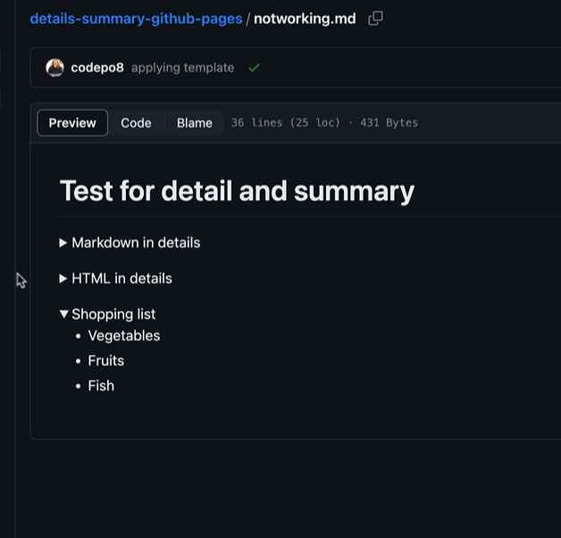
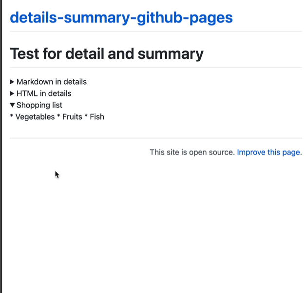
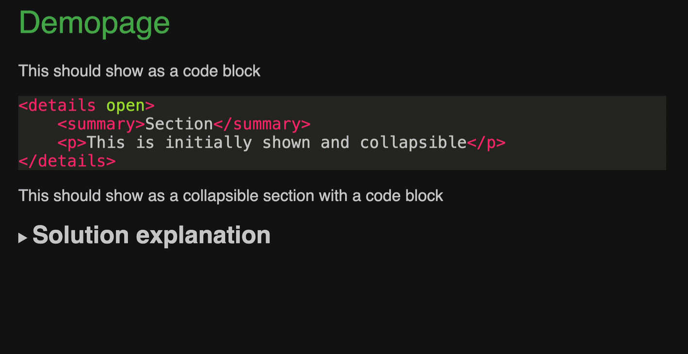
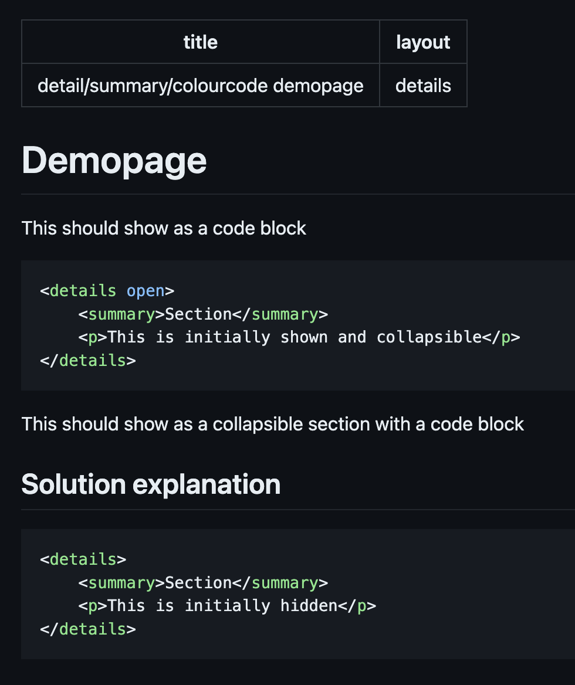

# Using details/summary in GitHub pages

As [CODE100](https://code100.dev) is coming to Amsterdam, we needed an archive of all the code puzzles we had so far. As the challenges are all on GitHub, it made sense to use GitHub pages for that. So I needed to fix two issues: 

* I wanted to have colour coding of code examples much like the GitHub own templates have.

* I wanted to have collapsible and expandable parts of the page. I did not want to write an own JavaScript solution for that.

Here is how to achieve both. You can check the [CODE100 puzzle archive](https://puzzles.code100.dev/) to see this in action. 

## Adding source code colour coding to GitHub pages

In your `config.yml` file define [kramdow](https://kramdown.gettalong.org) as the markdown used and [rouge](https://kramdown.gettalong.org/syntax_highlighter/rouge.html) as the highlighter. 

```yml
markdown: kramdown
highlighter: rouge
```

This allows you to use code fences and get colour coding. You can [add your own CSS](assets/dark-theme.css) to colour it any way you like.

## Adding collapsible elements using detail and summary

The new(ish) HTML elements detail and summary result in collapsible document sections. The great thing about these is that they don't need any script and work independent of input. Even better is that using in-page search also automatically expands sections.  At least in Chromium based browsers. The problem is that there is no way in markdown to define these sections. 

GitHub allows to use summary and detail as HTML inside their flavour of markdown. If you check the [notworking.md](notworking.md) file in the source repo, you can see it working.

 

However, if [you render it as GitHub Pages](https://codepo8.github.io/details-summary-github-pages/notworking) the content inside the `details` stays markdown and doesn't get rendered (even when you add newlines). You can of course use HTML (as the second demo shows), but this defeats the purpose of using markdown. 



My workaround was to use HTML comments and create an include to use in my page templates. 

HTML comments are great because they don't do anything in GitHub markdown. There seems to be no standard for Markdown comments, after all.

The `detail-summary.html` include is as simple as it gets:

```liquid
<!-- summary -->
<!-- details -->
<!-- endsummary -->
<!-- enddetails -->


{{ newhtml }}
```

In my page template I need to use this as a pre-render instead of simply using `{{ content }}`:

```liquid

```

And in my markdown files I use HTML comments:

```markdown
<!-- details -->

<!-- summary -->

## Solution

<!-- endsummary -->

``json

 [
   0,0,0,121,231,143,195,118,216,
   195,54,223,195,182,216,121,231,
   143,0,0,0,3,15,30,97,155,183,
   49,153,179,1,157,187,3,207,30,
   0,0,0
 ]
``

Did you get it? Did you find a better way?

<!-- enddetails -->
```

This [renders as a collapsed section](https://codepo8.github.io/details-summary-github-pages/demopage) with `Solution` as the summary.



The nice thing here is that it enhances progressively.  In the GitHub rendered readme it is just a headline.



If you want to play with this, I created a bare-bones version here. 